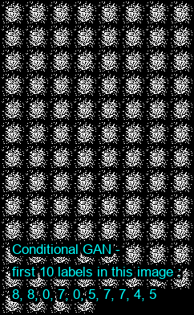
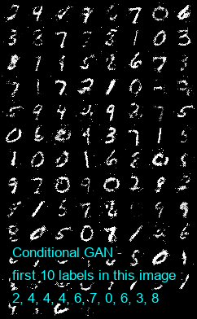
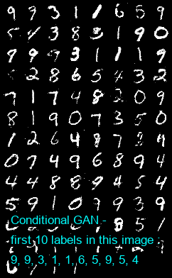
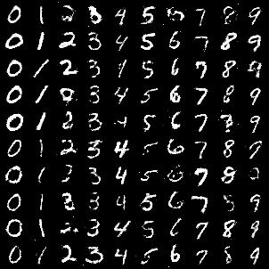

# CGAN
Conditional Generative Adversarial Nets

## Paper
[https://arxiv.org/pdf/1406.2661.pdf](https://arxiv.org/pdf/1411.1784.pdf)

<br/>

## Application technology
```
Python  
GAN(Generative Adversarial Nets)
Pytorch  
```

<br/>

## Result

 
1 Epoch

<br/>
<br/>

 
50 Epoch

<br/>
<br/>

 
100 Epoch

<br/>
<br/>

 
Generated image by labels
